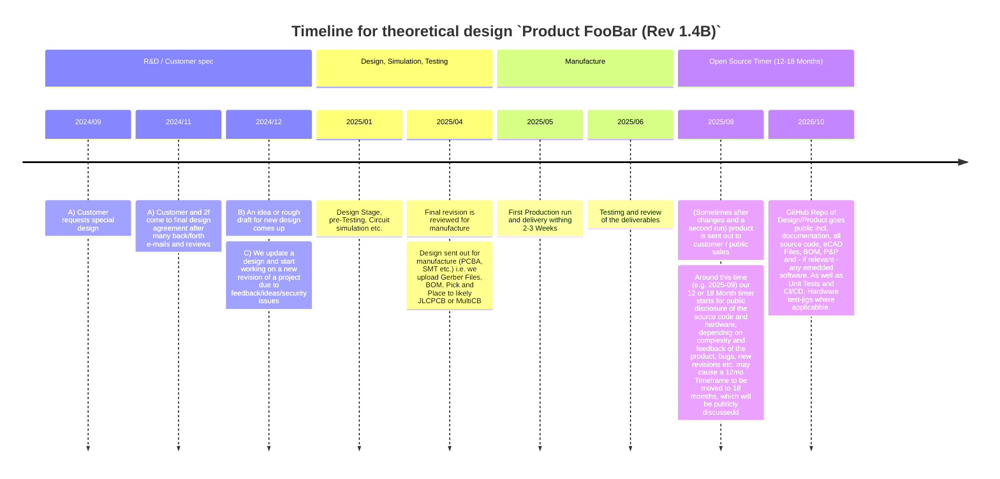

# $2f —$ Second Order Harmonics: _Analogue Sound for the Digital Age_

## Quick Start $-$ some of our public repos
1. [cheatsheets](https://github.com/SecondOrderHarmonics/cheatsheets) [Cheat-sheets: for EE in Analog audio circuit design]
2. [Audio-Summer](https://github.com/SecondOrderHarmonics/audio-summer_dsub25-to-combo-xlrtrs) [8x2 passive audio summer - DB25/Tascam to 2xXLR/TRS Combo Jacks]

## General Info
These are our GitHub Repos. Feel free to look through them. Please open issues if you find mistakes, have issues during your own production of one of our designs or have suggestions for future revisions.

## Links, Blog Posts and Further Info off-site
- www.secondorderharmonics.com & www.secondorderharmonics.eu
- https://www.patreon.com/secondorderharmonics
- https://www.facebook.com/profile.php?id=100090381861518

## Supportig us | Gaining early access
Open Hardware Projects, and related F/OSS (Free/Open Source Software), can be a lot of work. We do not have active sponsorship, Kickstarter Campaigns or anything similar. We currently live off other Day Jobs and custom design inquiries/modding of existing audio HW (from outboard gear to retooling and/or modding entire recording consoles, Working as Stand-by engineer(s) during Recording/Tracking and Mixing sessions as well as renting out our own high-end outboard gear for recording and mixing sessions). That being said: We're happy to share some of our work. Most of it, actually. And will try to keep to our understanding that welll-tested field deployed or commmercially available units will be made fully open later on in very specific cases (seee 'Licensing' below). You can support/help us and/or gain early access to projects, contribute ideas via Patreon [^patreon].

## So.. what's Open Source Software / Open Hardware and what isn't?
__Everything is__ as per our principles. Due to R&D, Testing and production costs of bigger HW projects or custom designs for private customers (which are encouraged to agree to open-source our work in time) - we reserve the right to have a few more advanced designs/products only available after a delay. There's multiple reasons for this, the five (5) main ones are:

1. Real world testing and feedback from customers, which takes some time depending on complexity of the product and adoption.
2. Time and Material cost on our own work (non-contract) that exceeds multiple thousands of Euros / USD.
3. As is already the case: we find hardware or software bugs in time and do not open-source, but reserve the time to fix any isssues that may cause 3rd parties to produce faulty products.
4. Missing documentation: if we open-source an advanced product we want to make sure you know how to re-produce every step 1:1 if you want to. Tests are available (LTSpice, Unit Tests, CI/CD Bots etc.), and lastly:
5. Security issues that come to our attention either by finding them ourselves or being reported. We fix them, then open a repo again to the public so you don't end up with costs for PCBA, SMT etc. cost just to have an insecure PCB laying around and having to re-order everything.

__The reality of these points being:__ some designs will be made public after 12-18 Months from the time of first production shipments.

#### Example Timeline: F/OSS & OSHW for 'closed off' projects

-----

We're more than happy about any feedback regarding our policies and would like to hear back from *you* regarding your thoughts on the topic. Please let us know via e-mail (see 'Contact' below) or - where appropriate - open an issue we can track here on GitHub itself.

## Licensing
Be aware that Projects may have varying kinds of more or less premissive Open Hardware / Software Licenses attached - usually depending on the project, a related customer or heavy upfromt-R&D involved with a specific project.

Typically we use Creative Commons licenses. There are exceptions (Like the CERN OHL and TAPR Open Hardware License), in general they are similarly "non-commercial, share-alike" type licenses. In some situations they fit better (e.g. Open-sourcing a customer design, with special permission).

#### Licenses we use for OSHW + F/OSS
- *CC0 1.0 Universal* aka. `Public Domain Dedication` [^2]
- *CC BY-NC-SA 4.0* [^3]
- [CERN OHL Version 2](https://gitlab.com/ohwr/project/cernohl/-/wikis/Documents/CERN-OHL-version-2) e.g. *CERN-OHL-S* [^4]
- *TAPR Open Hardware License v1.0* [^5]
  
## Contact
You may get in contact with us via: mailto:info@secondorderharmonics.eu

*Peace, Love & Unity,*     
– The Second Order Harmonics Team [<ins>AZ, KT</ins>]

[^patreon]: https://www.patreon.com/secondorderharmonics
[^2]: https://creativecommons.org/publicdomain/zero/1.0/
[^3]: https://creativecommons.org/licenses/by-nc-sa/4.0/
[^4]: https://gitlab.com/ohwr/project/cernohl/-/wikis/uploads/b236492596cfc91c12def7d50bbf7da0/cern_ohl_s_v2.pdf    
      https://gitlab.com/ohwr/project/cernohl/-/wikis/uploads/819d71bea3458f71fba6cf4fb0f2de6b/cern_ohl_s_v2.txt
[^5]: https://files.tapr.org/OHL/TAPR_Open_Hardware_License_v1.0.pdf     
      https://files.tapr.org/OHL/TAPR_Open_Hardware_License_v1.0.txt
